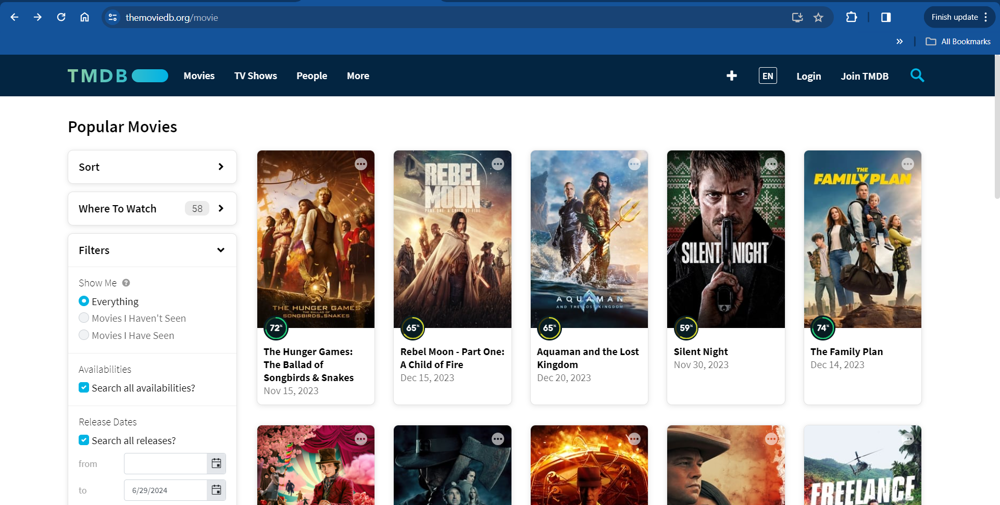
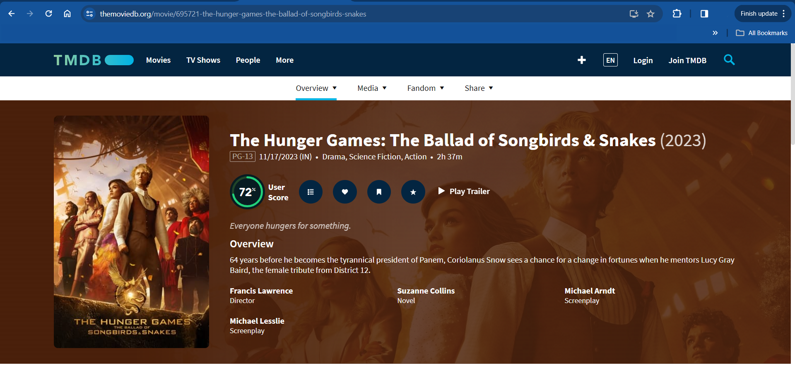
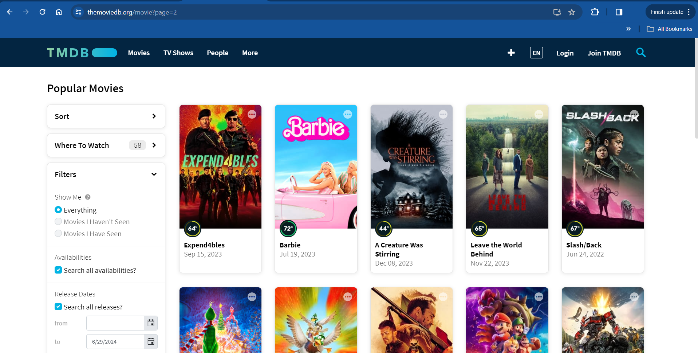

# MoviesScraping
Web scraping is a process to get data from a website. There are different web-scraping tools available on the market. Web scraping has many explanations, so this project will be to understand web scraping.
## Overview
* This project is to demonstrate web scraping using the Beautiful Soup library in Python.
* The project objective is to get movie details from the TMDB website.<br> [click here](https://www.themoviedb.org/movie)
* The required data to fetch is as follows:
  * Title
  * Date
  * Rating
  * Genres
  * Runtime
  * Overview
  * Director
## TMDB Popular Movies website
To scrap the data from the website wwe will have to understand the structure of the website.
1. The popular movie page contain blocks of movie data.
2. Click a movie's image or title for more information.
3. Type 'https://www.themoviedb.org/movie?page=2 ' which will take me to the next page.

With the above information we understand where and how to get the movie data.
## Algorithm
The algorithm is divided in 3 stages
### Stage 1: Getting the movie detail from the block
1) Getting movies block which is an ```<div>``` element of ```class='card style_1'```
2) Getting movie title which is the text data from the ```<h2>``` element in movie block
3) Getting movie date which is the text data from ```<p>``` element in movie block
4) Getting movie path from the ```<a>``` element in the movie block
5) Geting movie detail HTML data from the movie path.
6) Getting movies rating which is a ```<div>``` element of ```class='percent'``` where ```href='icon icon-r75``` contains the data in side the movie detail page.
7) Getting movies genres which is inside ```<span>``` element containing list of ```<a>``` element of movie detail page.
8) Getting movies runtime which is an ```<span>``` element of ```class='runtime'``` in the movie detail page.
9) Getting movies overview which is an ```<p>``` element in movie detail page.
10) Getting movies director which is one of the ```<li>``` element of ```class='profile'``` in the movie detail page.
### Stage 2: Getting movies detail on the page
1) Getting movie blocks which are a ```<li>``` element of ```class='card style_1'``` in the movie detail page.
2) Running stage 1 at each movie block in this page.
### Stage 3: Getting the movies detail from the 50 pages
1) Creating a list of 50 URL where the number at the end of the URL is incremented.<br>
**Example:**<br>
https://www.themoviedb.org/movie?page=1<br>
https://www.themoviedb.org/movie?page=2<br>
https://www.themoviedb.org/movie?page=3<br>
.<br>
.<br>
.<br>
https://www.themoviedb.org/movie?page=50
## Movie Pseudo Code
Code by divide and conquer method
Function to get movie detail from the BeautifulSoup object
```
func getMovieData(BeautifulSopupObject):
    get title from <h2> tag
    get date from <p> tag
    get movie path from <a href='path/to/movie'>
    get movie detail page HTML text
    convert HTML text to BeautifulSoupObject
    get rating from <div class='percent><span class='icon icon-r75></span></div> element of movie detail page.
    get text from list of <a> tag in <span class='genres'> of movie detail page.
    get runtime from <span class='runtime'> of movie detail page.
    get overview from <p> tag of movie detail page.
    get director from one of the <li> tag if it exists
    return all the collected data in a dictionary
```
Function to get list of movie detail from URL
```
func getAllMoviesDetail(URL):
    get HTML data from the URL
    Converting the HTML data to BeautifulSoup object as movies page
    get movie block BeautifulSoup objects which are <div class='card style_1'> tag into a list
    get movies data by using map(getMovieData, <list of movie block beautifulSoupObject>)
    return the tuple of movie data
```
Code to get movie detail and saving the data in excel
```
create a list of URL of movie pages
getting neated tuple of movies data by using map(getAllMoviesDetail, <list of URLs of movie pages>)
reducing nested tuple into single tuple using reduce(lambda t1, t2: t1 + t2, <nested tuple of movies>)
converting the tuple of movies data into pandas dataframe
saving the data frame in excel
```


## Summary
The movie is scraped from the [website](https://www.themoviedb.org/movie) using basic python coding and bs4 library.<br>
[Click Here](./MovieScraping.py) for the code